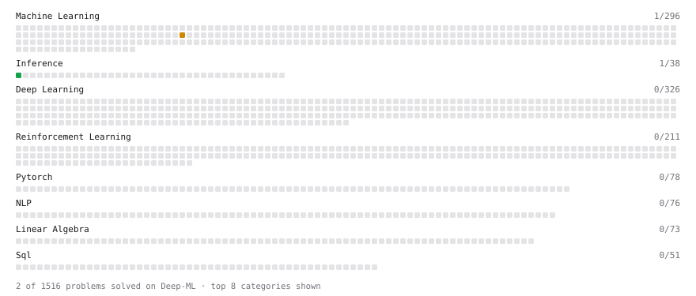

# Deep-ML

My machine learning practice from [Deep-ML](https://www.deep-ml.com). Every solution here was written by hand.

**7** solved · 7 problems · 0 labs · 0 math

[**Browse the interactive portfolio**](https://gFWG.github.io/deep-ml/) to replay this filling in over time.

## Problems

| | Difficulty | Solved | |
| --- | --- | --- | --- |
| [Compute Arithmetic Intensity and Classify Bottleneck](https://www.deep-ml.com/problems/414) | easy | 2026-10-09 | [solution](problems/0414-compute-arithmetic-intensity-and-classify-bottleneck) |
| [KV Cache Size Estimator for MLA vs MHA vs GQA](https://www.deep-ml.com/problems/1012) | easy | 2026-10-11 | [solution](problems/1012-kv-cache-size-estimator-for-mla-vs-mha-vs-gqa) |
| [Per-Token Decode Latency from Memory Bandwidth](https://www.deep-ml.com/problems/1214) | easy | 2026-10-09 | [solution](problems/1214-per-token-decode-latency-from-memory-bandwidth) |
| [Classify LLM Prefill vs Decode as Compute-Bound or Memory-Bound](https://www.deep-ml.com/problems/417) | medium | 2026-10-09 | [solution](problems/0417-classify-llm-prefill-vs-decode-as-compute-bound-or-memory-bound) |
| [Compute Attention Memory Traffic and FLOPs](https://www.deep-ml.com/problems/416) | medium | 2026-10-09 | [solution](problems/0416-compute-attention-memory-traffic-and-flops) |
| [End-to-End Latency Decomposition](https://www.deep-ml.com/problems/413) | medium | 2026-10-09 | [solution](problems/0413-end-to-end-latency-decomposition) |
| [Estimate KV Cache Size from Model Config](https://www.deep-ml.com/problems/418) | medium | 2026-10-11 | [solution](problems/0418-estimate-kv-cache-size-from-model-config) |

---

_This file is regenerated by Deep-ML on every push._
